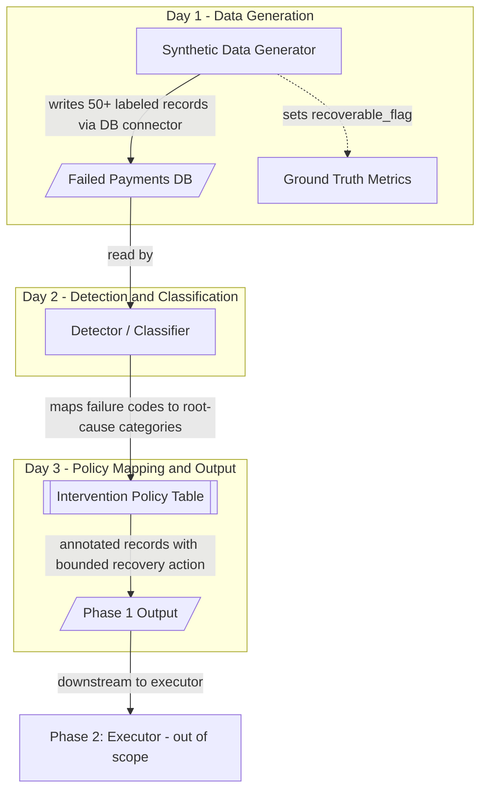

#AI Revenue Recovery - Failed-Payment Recovery Agent
## Phase 1 Implementation Plan (Days 1-3)
## 1. Overview
Phase 1 covers the **Foundations** (Days 1-3) of a 10-day build for an AI Revenue Recovery agent (Hackathon Track 3).
The goal of Phase 1 is to **get a thin decision loop breathing**: generate synthetic labeled data → detect/classify failure root causes → map each failure to a bounded intervention. **No execution/retry happens in Phase 1** (that's
Phase 2) -
**Phase 1 milestone:** query the batch and print, per record, "failure type → chosen action* The project takes the **"Payment degradation → root cause → recovery action"** direction: an agent that detects revenue at risk from failed payments, diagnoses root cause, chooses the right intervention, and (in later phases) executes a bounded recovery workflow with stopping rules and an audit trail. The competition bar: **measured money recovered across a batch, compliant escalation, stopping rules, and an audit trail** - *"one cherry-picked match proves nothing."*
## 2. Phase 1 Scope & Non-Goals
**In scope: ** synthetic dataset (50+ records) with labeled ground truth, root-cause detector/classifier, static intervention policy table, annotated decision-preview output.
**Non-goals (deferred):**
- Actual execution/retries → Phase 2
- Razorpay test-mode API integration → use a mock rail first
- ML models → use a rules table
Audit trail + MNPI masking → Phase 3
- Graceful-failure demo → Phase 3
- Escalation tiers → Phase 3
- UI/dashboard → Phase 4
## 3. Architecture Plan
Left-to-right data flow:
- **Synthetic Data Generator (Day 1)** produces 50+ failed-payment records, each labeled with a failure reason and a
"recoverable_flag marking membership in the known-recoverable ground-truth subset.
- Data is written to a **Database via a database connector** (" failed _payments* table).
- **Detector/Classifier (Day 2)** reads records and maps raw decline/failure codes → root-cause categories.
- **Intervention Policy Table (Day 3)** is a static rules mapping of root-cause category → bounded recovery action.
- **Phase 1 Output** is an annotated batch showing failure type → chosen action* (decision preview, no execution).
-**Ground-truth labels** (recoverable_flag) set at Day 1 feed later measurement of recovery rate.

## 3.1 Open-Source Tech Stack (Phase 1)
All components below are permissively licensed open-source (MIT / BSD / Apache-2.0 / PSF) - no paid or proprietary dependencies.
| Layer Open-Source Choice | License | Why it fits Phase 1 |
-------
| Language / runtime | **Python 3.11+** | PSF | Fastest path for data + rules logic; huge ecosystem | | Synthetic data generation | **Faker** + **NumPy** | MIT / BSD | Faker for realistic customer refs/amounts; NumPy for seeded, reproducible distributions l
| Data handling | **pandas** | BSD-3 | Batch manipulation, category counts, join classifier output to policy table l
| Database | **SQLite** (stdlib) or **PostgreSQL** | Public Domain / PostgreSQL License | sQlite = zero-setup for a 50+
record batch; Postgres if you want a "real" DB |
| DB access / ORM | **SQLAlchemy** | MIT | Clean connector layer + schema definition; DB-agnostic (SQLite + Postgres) | | Schema / validation | **Pydantic v2** | MIT | Enforce "failed payments" field types and the root-cause enum at generation time I
| Rules engine | Plain Python dict/enum mapping (optional: **durable-rules**) | MIT | Deterministic "failure_code → category and category → action; keep it simple & auditable l
| Classifier accuracy metrics | **scikit-learn** ( classification_report) | BSD-3 | Measure predicted category vs root_cause_label (precision/recall/accuracy) |
Config | **PyYAML** | MIT | Externalize the taxonomy + policy table as editable YAML I | Testing | **pytest** | MIT | Validate generator output and classifier mappings |
| Reproducibility | **python-doten** + fixed random seed | BSD | Deterministic re-runs so metrics are credible, not lucky |
| Diagram rendering | **Mermaid** | MIT | Architecture diagram as code (renders on GitHub/GitLab/VS Code) |
| Notebook (optional) | **Jupyter** | BSD-3 | Interactive Day-2/Day-3 inspection of the batch |
**Minimal footprint if you want to travel light:** "Python + pandas + SQLAlchemy + SQLite + Pydantic + scikit-learn.
That covers generation, storage, classification, and accuracy measurement.

## 4. Data Model - "failed_payments*
| Field | Type | Description | MNPI/PII? |
---------------------------------
---
"txn_id"
1 string | Unique transaction id | No |
amount | decimal | Transaction amount | No l
"currency" | string | ISO currency code (eg-, INR) | No l
"failure_code" | string | Raw gateway decline/failure code | No |
"root_cause_label | string | Ground-truth root-cause category I No
"recoverable_flag" | boolean | Ground truth: is this genuinely recoverable | No |
"retry_count | integer | Prior retry attempts | No |
"timestamp" | datetime | Time of failed attempt | No l
Customer restriCter identifier masked downstream**|
I payment_method | string | card / upi / netbanking / mandate | No l

## 5. Root-Cause Category Taxonomy
| Root-Cause Category | Example Failure Codes / Signals | Recoverable? |
ا---_-____-__--|-_____-
Insufficient Funds | "insufficient_funds, "51 do not honor (low balance) | Yes (timing-dependent) |
Expired Card | expired card, "54° | Yes (needs re-auth)
| Transient/Network | issuer_unavailable, "gateway_timeout"
*91" | Yes (retry) |
Mandate Lapse | "mandate_revoked, "mandate_expired| Yes (re-authorization) I
i Hard Fraud / Do-Not-Retry I"fraud_suspected, "stolen_card, "do_not_honor (blocklist) | No (escalate) |

## 6. Intervention Policy Table (static rules, Day 3)
Root-Cause Category | Bounded Recovery Action | Stopping Rule / Bound |
-----------
--------
Insufficient Funds | Smart retry scheduled on payday/salary-credit window | Max 3 retries, min 48h apart | Expired Card | Trigger dunning message + request card re-authorization | Max 2 dunning attempts over 7 days | Transient/Network | Immediate smart retry with exponential backoff | Max 3 retries, backoff 1h/6h/24h |
| Mandate Lapse | Request mandate re-authorization from customer | 1 request, then escalate | | Hard Fraud / Do-Not-Retry | NO automated action; escalate to human review | Hard stop, zero retries |
*Bounds are defined here but enforced in Phase 2.*

## 7. Task Breakdown (Days 1-3)
**Day 1 - Synthetic Data + Ground Truth**
- **T1.1** Define 'failed_payments*
schema (Pydantic model + SQLAlchemy table) and create the DB table (SQLite via
SQLAchemy) -
- **T1.2** Build synthetic data generator (Faker + NumPy, seeded) producing 50+ records across all five root-cause categories with a realistic distribution.
- **T1.3** Seed the recoverable_flag ground truth (label the known-recoverable subset) **before** building the agent, to avoid cherry-picking.
-**1.4** Include realistic messiness (varied amounts, "retry_count > 0° for some, mix of payment methods).
- **T1.5** Validate (Pydantic) & load dataset (pandas → SQLAlchemy); sanity-check category counts.

**Day 2 - Detector / Classifier**
- **T2.1** Build a failure_code → root-cause-category mapping function (Python dict/enum, driven by a PyYAML taxonomy config) .
- **T2.2** Handle unmapped/unknown codes gracefully (route to an "Unknown/ Ambiguous" bucket for human review).
- **T2.3** Run classifier over the batch; compare predicted category vs root_cause_label' using scikit-learn
"classification_report.
-**T2.4** Log any misclassifications for review.

**Day 3 - Intervention Policy + Phase 1 Output**
- **T3.1** Encode the static intervention policy table (category → bounded action + bounds) as editable YAML.
- **T3.2** Join classifier output to the policy table (pandas merge) so each record gets a chosen action.
- **T3.3**
Produce the Phase 1 annotated output: per-record failure type → chosen action preview.
- **T3.4**
Print Phase 1 summary counts (records per category, records per intervention, count of do-not-retry/
escalate).

## 8. Phase 1 Exit Criteria / Definition of Done

- [ ] 50+ synthetic records loaded in DBwith labeled root cause + recoverable_flag ground truth.

- [ ] Detector classifies every record into a root-cause category (or explicit Unknown bucket) •

- [ ] Classifier accuracy measured against ground-truth labels.

- [ ] Every record mapped to a bounded intervention via the policy table.

- [ ] Annotated failure type → chosen action preview produced for the full batch.

- [ ] No execution performed (correctly deferred to Phase 2).

## 9. Risks & Mitigations for Phase 1
| Risk | Mitigation |
| Labeling ground truth after building the agent (cherry-picking risk) | Seed recoverable_flag on Day 1 before any agent logic l
| Over-engineering with ML too early | Use a deterministic rules table; defer ML |
| Starting with Razorpay API integration and getting blocked | Build against a mock rail first; wire test-mode APIs later |
| Unrealistic synthetic data that inflates results | Inject messiness and a mix of recoverable/non-recoverable cases |