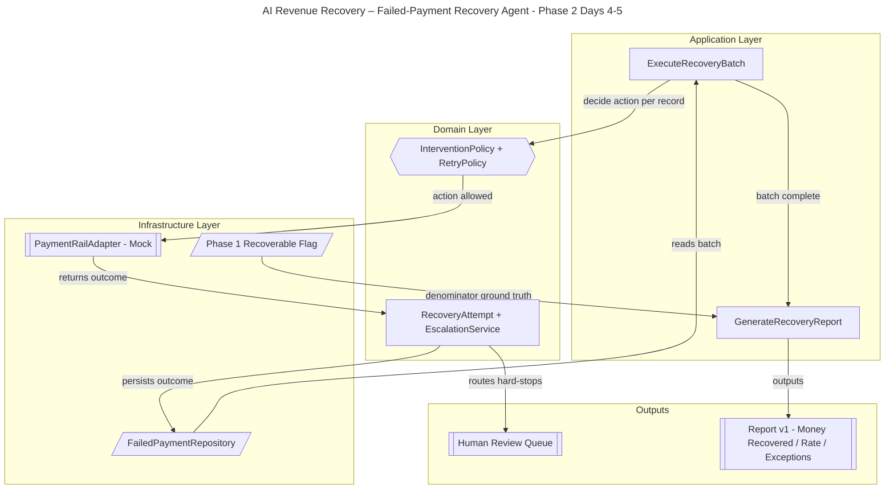

# AI Revenue Recovery – Failed-Payment Recovery Agent
## Phase 2 Implementation Plan (Days 4–5): Close the Loop

## 1. Overview

Phase 2 is the **make-or-break** phase: it turns Phase 1's *decision preview* into an actual **executed recovery loop** across the 50+ record batch. By the end of Day 5 the agent runs end to end — reads the batch, decides the bounded action per record, attempts recovery against a payment rail, records outcomes, escalates hard-stops, and prints a **money-recovered number**.

**Phase 2 milestone:** the full loop runs on all 50+ records and produces `money recovered / recoverable` (v1 report). Hit this and you have a submittable project — everything after is upside.

Design constraint carried forward: **internal DDD-style modular monolith** — one deployable, but cleanly layered into **Application** (use-cases), **Domain** (pure business logic + invariants), and **Infrastructure** (adapters behind ports).

## 2. Phase 2 Scope & Non-Goals

**In scope:**

- Executor use-case that drives the batch (`ExecuteRecoveryBatch`).
- Domain-modeled bounded execution: retry caps, backoff windows, min-intervals, do-not-retry hard stops.
- `RecoveryAttempt` outcomes persisted (recovered / failed / skipped / escalated).
- Escalation of hard-fraud + stopping-rule-tripped items to a human-review queue.
- Report v1: money recovered vs recoverable, recovery rate, intervention breakdown, exception list.
- A **MockPaymentRail** adapter behind a `PaymentRailPort` (real Razorpay test-mode swappable later).

**Non-goals (deferred):**

- Real Razorpay test-mode API wiring → Phase 2 stretch / Phase 3 (swap behind the same port)
- Audit trail + MNPI masking → Phase 3
- Graceful-failure *demo narrative* + escalation tiers polish → Phase 3
- UI/metrics dashboard → Phase 4
- ML-based intervention selection → out of scope (rules stay deterministic)

## 3. Architecture Plan

### 3.1 DDD layering (internal, single deployable)

- **Application layer** orchestrates; holds no business rules.
  - `ExecuteRecoveryBatch` — pulls Phase 1 annotated decisions and drives execution across the batch.
  - `GenerateRecoveryReport` — aggregates outcomes into report v1.
- **Domain layer** is pure (no I/O), holds all invariants.
  - `FailedPayment` (entity) with behaviors: `can_retry()`, `is_do_not_retry()`.
  - `InterventionPolicy` (domain policy): `decide(root_cause)` → `Decision` (bounded action + stopping rule).
  - `RetryPolicy` / `StoppingRules` (value objects / domain service): max retries, backoff windows (1h/6h/24h), min-interval, hard-stop on do-not-retry.
  - `RecoveryAttempt` (entity): records each bounded attempt + outcome.
  - `EscalationService` (domain service): routes hard-fraud / stopping-rule-tripped items to human review.
- **Infrastructure layer** implements ports as adapters.
  - `FailedPaymentRepository` (port → SQLAlchemy/SQLite adapter): reads batch, persists outcomes.
  - `PaymentRailAdapter` (port): `MockPaymentRail` simulating retry / dunning / re-auth responses.
  - `Clock/Scheduler` adapter: simulated time for backoff windows.

### 3.2 Flow

`ExecuteRecoveryBatch` reads the batch via `FailedPaymentRepository` → for each record calls `InterventionPolicy.decide` + `RetryPolicy` checks → if allowed, invokes `PaymentRailAdapter` (mock) to attempt recovery → records a `RecoveryAttempt` outcome → if a stopping rule trips or the code is do-not-retry, `EscalationService` routes it to the Human Review queue. Outcomes persist back via the repository. `GenerateRecoveryReport` then aggregates money recovered vs recoverable (**ground-truth** `recoverable_flag` from Phase 1 as the denominator), recovery rate, intervention breakdown, and the exception list.

### 3.3 Visual Architecture Diagram



## 4. Proposed Module Layout (DDD monolith)

```text
revenue_recovery/
├── domain/
│   ├── entities.py             # FailedPayment (+behaviors), RecoveryAttempt
│   ├── policies.py             # InterventionPolicy, RetryPolicy, StoppingRules
│   ├── services.py             # EscalationService (pure domain service)
│   └── value_objects.py        # Decision, Outcome, BackoffWindow
├── application/
│   ├── execute_recovery_batch.py  # ExecuteRecoveryBatch use-case
│   └── generate_recovery_report.py # GenerateRecoveryReport use-case
├── infrastructure/
│   ├── ports.py                # PaymentRailPort, FailedPaymentRepositoryPort, ClockPort
│   ├── repository.py           # SQLAlchemy/SQLite adapter
│   ├── mock_payment_rail.py   # MockPaymentRail adapter
│   └── clock.py               # simulated Clock/Scheduler adapter
└── tests/
    ├── test_retry_policy.py
    ├── test_execute_batch.py
    └── test_report.py
```

## 5. Domain Model (key objects & invariants)

| Object | Layer | Type | Key behavior / invariant |
|---|---|---|---|
| `FailedPayment` | Domain | Entity | `can_retry()` (respects retry cap); `is_do_not_retry()` true for HARD_FRAUD |
| `InterventionPolicy` | Domain | Policy | `decide(root_cause) -> Decision`; never returns an action for do-not-retry |
| `RetryPolicy` / `StoppingRules` | Domain | Value object / service | Enforces max retries, min-interval, backoff 1h/6h/24h; trips hard stop |
| `Decision` | Domain | Value object | Immutable: chosen action + bound + rationale |
| `RecoveryAttempt` | Domain | Entity | Records action, timestamp, outcome (recovered/failed/skipped/escalated) |
| `EscalationService` | Domain | Domain service | Routes do-not-retry + stopping-rule trips to human review |
| `FailedPaymentRepository` | Infra | Port + adapter | Reads batch; persists attempts/outcomes |
| `PaymentRailAdapter` | Infra | Port + adapter | `MockPaymentRail`; Razorpay test-mode swappable behind same port |
| `Clock/Scheduler` | Infra | Port + adapter | Simulated time so backoff windows are testable |

## 6. Bounded-Execution Rules (enforced this phase)

| Root-Cause Category | Bounded Action | Stopping Rule / Bound |
|---|---|---|
| Insufficient Funds | Smart retry on payday/salary-credit window | Max 3 retries, min 48h apart |
| Expired Card | Dunning message + request card re-authorization | Max 2 dunning attempts over 7 days |
| Transient / Network | Immediate smart retry with exponential backoff | Max 3 retries, backoff 1h/6h/24h |
| Mandate Lapse | Request mandate re-authorization | 1 request, then escalate |
| Hard Fraud / Do-Not-Retry | NO automated action; escalate to human | Hard stop, zero retries |

## 7. Task Breakdown (Days 4–5)

**Day 4 — Executor + bounded execution (Domain + Infrastructure)**

- **T4.1** Define ports in `infrastructure/ports.py`: `PaymentRailPort`, `FailedPaymentRepositoryPort`, `ClockPort`.
- **T4.2** Implement `MockPaymentRail` adapter: deterministic, seeded responses per action type (retry/dunning/re-auth → success/failure).
- **T4.3** Model domain value objects: `Decision`, `Outcome`, `BackoffWindow`.
- **T4.4** Implement `RetryPolicy` / `StoppingRules`: retry caps, min-interval, backoff schedule, hard-stop on do-not-retry.
- **T4.5** Add `FailedPayment` behaviors (`can_retry()`, `is_do_not_retry()`) and `RecoveryAttempt` entity.
- **T4.6** Implement `EscalationService`: route do-not-retry + stopping-rule trips to a human-review queue structure.
- **T4.7** Implement `ExecuteRecoveryBatch` use-case: orchestrate repo read → decide → rail attempt → record outcome → escalate.
- **T4.8** Wire `Clock` adapter (simulated time) so backoff windows advance deterministically in a batch run.

**Day 5 — Reporting v1 (Application)**

- **T5.1** Implement `GenerateRecoveryReport` use-case aggregating persisted `RecoveryAttempt` outcomes.
- **T5.2** Compute **money recovered** and the honest denominator: recoverable amount from Phase 1 `recoverable_flag` ground truth.
- **T5.3** Compute **recovery rate** (recovered / recoverable) and intervention breakdown (per category counts + successes).
- **T5.4** Produce the **exception list**: unresolved records with reason codes (do-not-retry, retries-exhausted, rail-declined).
- **T5.5** Print the Phase 2 summary: ₹ recovered vs ₹ at-risk, recovery rate, intervention mix, escalation count.

## 8. Metrics Emitted (Report v1)

| Metric | Definition |
|---|---|
| Money recovered | Sum of `amount` for records whose recovery attempt succeeded |
| Recoverable (denominator) | Sum of `amount` where Phase 1 `recoverable_flag = true` |
| Recovery rate | Money recovered / recoverable |
| Intervention breakdown | Attempts + successes per intervention type |
| Escalation count | Records routed to human review (do-not-retry + stopping-rule trips) |
| Exception list | Unresolved records + reason code |

## 9. Phase 2 Exit Criteria / Definition of Done

- [ ] `ExecuteRecoveryBatch` runs end to end over all 50+ records.
- [ ] Every money action is bounded (retry caps, min-interval, backoff enforced by `RetryPolicy`).
- [ ] Do-not-retry (hard-fraud) records are never retried and are escalated.
- [ ] `RecoveryAttempt` outcomes persisted for every record.
- [ ] Report v1 prints money recovered, recovery rate (vs Phase 1 ground truth), intervention breakdown, and exception list.
- [ ] Payment rail is behind a port; `MockPaymentRail` used, Razorpay test-mode swappable without touching domain/application code.
- [ ] Domain layer has no I/O (pure), verified by tests.

## 10. Risks & Mitigations for Phase 2

| Risk | Mitigation |
|---|---|
| Starting with Razorpay API and getting blocked | Build against `MockPaymentRail` behind a port; swap test-mode later without touching domain |
| Backoff/timing hard to test in a short batch run | Use a simulated `Clock` adapter so windows advance deterministically |
| Business rules leaking into adapters (breaks DDD) | Keep all invariants in Domain; Application only orchestrates; Infra only does I/O |
| Recovery rate looks inflated | Use Phase 1 `recoverable_flag` as the honest denominator; report unrecoverable separately |
| Unbounded retries / hammering customers | `RetryPolicy` caps + min-interval + hard-stop enforced and unit-tested |
| Exceptions dumped without reasons | Reason-code every unresolved record in the exception list |