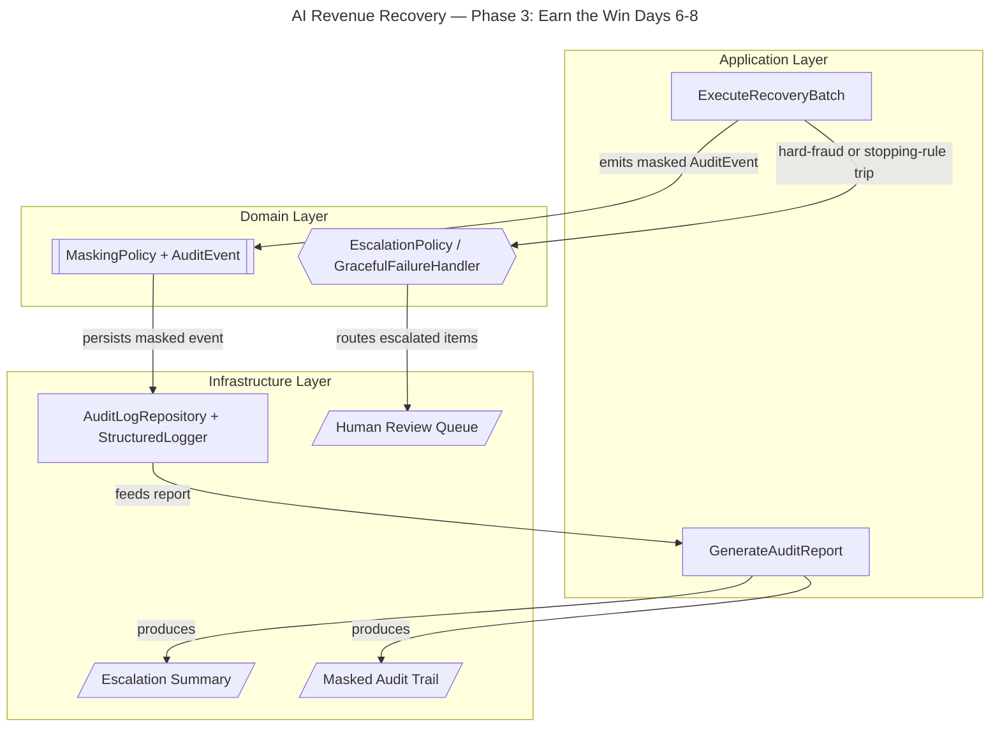

# AI Revenue Recovery — Failed-Payment Recovery Agent
## Phase 3 Implementation Plan (Days 6–8): Earn the Win

## 1. Overview

Phase 3 is where you **hit the competition bar precisely**. Phase 2 gave you a working, bounded recovery loop with a
money-recovered number. Phase 3 layers on the things judges actually reward: **an explainable audit trail, MNPI/PII
masking, a graceful-failure demo, and tiered escalation** — all on top of the DDD monolith, no rewrites.

**The bar this phase satisfies:** *every money action explainable, bounded, and gated; show the audit trail and one
failure handled gracefully.*

**Phase 3 milestone:** every money action emits a masked, append-only audit event; hard-fraud/stopping-rule trips are
correctly *refused* and escalated; and you can produce an explainable audit trail + escalation summary for the full
batch.

Design constraint carried forward: **internal DDD-style modular monolith**, **open-source only**. Masking is a **plain
Python domain service** (`hashlib`/regex redaction) — no proprietary or LLM Suite features anywhere.

## 2. Phase 3 Scope & Non-Goals

**In scope:**

- `AuditEvent` domain object — immutable record of every money action.
- `MaskingPolicy` domain service — redacts MNPI/PII (`customer_ref`) before it enters any log or output.
- Append-only audit persistence (`AuditLogRepository`) + structured logging.
- `EscalationPolicy` — tiered escalation (automated retry → dunning → human handoff).
- `GracefulFailureHandler` — the agent correctly *refuses* to act on hard-fraud / stopping-rule trips and escalates
  instead.
- `GenerateAuditReport` use-case — explainable audit trail + escalation summary.

**Non-goals (deferred):**

- UI / metrics dashboard → Phase 4
- Final demo narrative + slide polish → Phase 4
- Real Razorpay test-mode wiring → optional swap behind the existing port
- ML-based decisions → out of scope (rules stay deterministic)

## 3. Architecture Plan

### 3.1 DDD layering (open-source, single deployable)

- **Application layer** orchestrates; no business rules.
- `ExecuteRecoveryBatch` (reused from Phase 2) — now emits an audit event for every money action.
- `GenerateAuditReport` — assembles the human-readable audit trail + escalation summary.
- **Domain layer** is pure (no I/O), holds all invariants.
- `AuditEvent` (entity / value object): immutable — timestamp, `txn_id`, decision rationale, action, outcome, reason
  code.
- `MaskingPolicy` (domain service): deterministic redaction of MNPI/PII before it enters any audit log or output.
- `EscalationPolicy` (domain service): Tier 1 automated retry → Tier 2 dunning → Tier 3 human handoff for high-value/
  repeated failures or hard-fraud.
- `GracefulFailureHandler` (domain service): on hard-fraud decline or stopping-rule trip, refuses to act and routes
  to escalation instead of retrying.
- **Infrastructure layer** implements ports as adapters (all open source).
- `AuditLogRepository` (port + SQLAlchemy/SQLite adapter): **append-only** persistence of masked audit events.
- `StructuredLogger` adapter (Python `logging` / `structlog`): emits masked structured logs.
- `Human Review Queue` adapter: receives escalated items.

### 3.2 Flow

`ExecuteRecoveryBatch` performs each bounded money action → emits an `AuditEvent` → `MaskingPolicy` masks MNPI/PII
(`customer_ref`) → the masked event is persisted **append-only** via `AuditLogRepository` and emitted via
`StructuredLogger`. `EscalationPolicy` applies the tiers; `GracefulFailureHandler` intercepts hard-fraud /
stopping-rule trips and routes them to the Human Review Queue — a *refused* action that is itself audited.
`GenerateAuditReport` reads the masked audit events to produce the explainable audit trail + escalation summary.

### 3.3 Visual Architecture Diagram



## 4. Proposed Module Layout (additions to the DDD monolith)

```text
revenue_recovery/
├── domain/
│   ├── audit.py                 # AuditEvent (immutable), reason codes
│   ├── masking.py               # MaskingPolicy (hashlib/regex redaction)
│   ├── escalation.py            # EscalationPolicy (tiers), GracefulFailureHandler
│   └── ...                       # (entities/policies from Phase 1-2)
├── application/
│   ├── execute_recovery_batch.py   # reused; now emits AuditEvents
│   └── generate_audit_report.py     # GenerateAuditReport use-case
├── infrastructure/
│   ├── audit_repository.py       # append-only SQLAlchemy/SQLite adapter
│   ├── structured_logger.py      # structlog / logging adapter (masked)
│   └── ...                       # (repository, mock rail, clock from Phase 2)
└── tests/
    ├── test_masking.py
    ├── test_audit_append_only.py
    ├── test_graceful_failure.py
    └── test_escalation_tiers.py
```

## 5. Open-Source Tech Stack (Phase 3 additions)

All permissively licensed — nothing proprietary, nothing LLM Suite.

| Concern | Open-Source Choice | License | Role |
|---|---|---|---|
| MNPI/PII masking | Python stdlib `hashlib` + `re` | PSF | Deterministic redaction/hashing of `customer_ref` |
| Structured logging | `structlog` (or stdlib `logging`) | Apache-2.0 / PSF | Masked, machine-readable audit logs |
| Audit persistence | SQLAlchemy + SQLite | MIT / Public Domain | Append-only audit table |
| Immutability | `pydantic` (frozen models) / `dataclasses(frozen=True)` | MIT / PSF | Enforce `AuditEvent` immutability |
| Testing | `pytest` | MIT | Verify masking, append-only, graceful refusal, tiers |

Add to `requirements.txt`:

```text
structlog>=24.1
```

*(pydantic, SQLAlchemy, pytest are already pulled in from Phases 1–2.)*

## 6. Audit Event Model

| Field | Type | Description | Masked? |
|---|---|---|---|
| `event_id` | string | Unique audit event id | No |
| `txn_id` | string | Related transaction | No |
| `timestamp` | datetime | When the action occurred | No |
| `action` | string | Bounded action taken (retry / dunning / re-auth / refuse) | No |
| `outcome` | string | recovered / failed / skipped / escalated | No |
| `reason_code` | string | do_not_retry / retries_exhausted / rail_declined / recovered | No |
| `customer_ref_masked` | string | Redacted customer identifier | **YES** |
| `decision_rationale` | string | Why this action (root cause + policy) | No |
| `tier` | string | Escalation tier applied (T1/T2/T3) | No |

### `domain/audit.py` — T6.1

```python
"""T6.1 — AuditEvent: immutable domain record of every money action."""
from __future__ import annotations

import enum
from datetime import datetime

from pydantic import BaseModel, ConfigDict


class ReasonCode(str, enum.Enum):
    RECOVERED = "recovered"
    RETRIES_EXHAUSTED = "retries_exhausted"
    RAIL_DECLINED = "rail_declined"
    DO_NOT_RETRY = "do_not_retry"
    STOPPING_RULE_TRIP = "stopping_rule_trip"


class ActionType(str, enum.Enum):
    RETRY = "retry"
    DUNNING = "dunning"
    REAUTH = "re-auth"
    REFUSE = "refuse"  # graceful failure — a first-class audited outcome


class Outcome(str, enum.Enum):
    RECOVERED = "recovered"
    FAILED = "failed"
    SKIPPED = "skipped"
    ESCALATED = "escalated"


class AuditEvent(BaseModel):
    """Immutable (frozen) — an audit record can never be mutated after creation."""
    model_config = ConfigDict(frozen=True)

    event_id: str
    txn_id: str
    timestamp: datetime
    action: ActionType
    decision_rationale: str
    outcome: Outcome
    reason_code: ReasonCode
    customer_ref_masked: str  # already masked before construction
    tier: str                  # T1 / T2 / T3
```

### `domain/masking.py` — T6.2

```python
"""T6.2 — MaskingPolicy: deterministic MNPI/PII redaction. Pure domain, no I/O."""
from __future__ import annotations

import hashlib
import re


class MaskingPolicy:
    """Redacts customer_ref before it can enter any log or audit sink.

    Deterministic so the same customer maps to the same token across events
    (useful for correlation) without ever exposing raw PII.
    """

    def __init__(self, salt: str = "revenue-recovery-phase3") -> None:
        self._salt = salt

    def mask_customer_ref(self, raw: str) -> str:
        if not raw:
            return "MASKED::empty"
        digest = hashlib.sha256(
            f"{self._salt}:{raw}".encode("utf-8")
        ).hexdigest()[:12]
        return f"MASKED::{digest}"

    def scrub_text(self, text: str) -> str:
        """Defensive scrub for free-text rationales: strip phone/email-like tokens."""
        text = re.sub(r"\b\d{10,}\b", "MASKED::num", text)
        text = re.sub(r"[\w.\-]+@[\w.\-]+", "MASKED::email", text)
        return text
```

### `infrastructure/audit_repository.py` — T6.3

```python
"""T6.3 — Append-only audit persistence (SQLAlchemy/SQLite). No update/delete."""
from __future__ import annotations

from datetime import datetime

from sqlalchemy import DateTime, String, create_engine
from sqlalchemy.orm import DeclarativeBase, Mapped, Session, mapped_column

from domain.audit import AuditEvent


class AuditBase(DeclarativeBase):
    pass


class AuditEventRow(AuditBase):
    __tablename__ = "audit_events"

    event_id: Mapped[str] = mapped_column(String, primary_key=True)
    txn_id: Mapped[str] = mapped_column(String, nullable=False)
    timestamp: Mapped[datetime] = mapped_column(DateTime, nullable=False)
    action: Mapped[str] = mapped_column(String, nullable=False)
    decision_rationale: Mapped[str] = mapped_column(String, nullable=False)
    outcome: Mapped[str] = mapped_column(String, nullable=False)
    reason_code: Mapped[str] = mapped_column(String, nullable=False)
    customer_ref_masked: Mapped[str] = mapped_column(String, nullable=False)
    tier: Mapped[str] = mapped_column(String, nullable=False)


class AuditLogRepository:
    """Append-only. Exposes ONLY append() and read helpers — no update/delete."""

    def __init__(self, db_url: str = "sqlite:///audit_log.db") -> None:
        self._engine = create_engine(db_url, echo=False)
        AuditBase.metadata.create_all(self._engine)

    def append(self, event: AuditEvent) -> None:
        with Session(self._engine) as session:
            session.add(
                AuditEventRow(
                    **event.model_dump(mode="python"),
                    action=event.action.value,
                    outcome=event.outcome.value,
                    reason_code=event.reason_code.value,
                )
            )
            session.commit()

    def all_events(self) -> list[AuditEventRow]:
        with Session(self._engine) as session:
            return list(session.query(AuditEventRow).all())
```

### `infrastructure/structured_logger.py` — T6.4

```python
"""T6.4 — StructuredLogger adapter. Only ever receives already-masked events."""
from __future__ import annotations

import structlog

from domain.audit import AuditEvent


_logger = structlog.get_logger("revenue_recovery.audit")


class StructuredLogger:
    def emit(self, event: AuditEvent) -> None:
        _logger.info(
            "money_action",
            event_id=event.event_id,
            txn_id=event.txn_id,
            action=event.action.value,
            outcome=event.outcome.value,
            reason_code=event.reason_code.value,
            tier=event.tier,
            customer_ref=event.customer_ref_masked,  # already masked upstream
        )
```

## 7. Escalation Tiers (Day 8)

| Tier | Trigger | Action |
|---|---|---|
| Tier 1 — Automated retry | Transient/network, insufficient-funds within bounds | Bounded smart retry |
| Tier 2 — Dunning / re-auth | Expired card, mandate lapse, retry window exhausted | Customer message + re-authorization request |
| Tier 3 — Human handoff | Hard-fraud, high-value, repeated failures, stopping-rule trip | Route to Human Review Queue; no automated money action |

### Day 6 — Audit trail + MNPI/PII masking

- **T6.1** Define `AuditEvent` as an immutable domain object (frozen pydantic) with reason-code enum.
- **T6.2** Implement `MaskingPolicy` domain service: deterministic redaction of `customer_ref`. No raw PII leaves the
  domain.
- **T6.3** Implement `AuditLogRepository` as an **append-only** SQLAlchemy/SQLite adapter (no update/delete).
- **T6.4** Implement `StructuredLogger` adapter emitting masked structured logs.
- **T6.5** Wire `ExecuteRecoveryBatch` to emit a masked `AuditEvent` for **every** money action (including refusals).
- **T6.6** Test: assert no unmasked `customer_ref` ever reaches the log/repo; assert audit rows are append-only.

### `application/execute_recovery_batch.py` (Phase 3 wiring) — T6.5 / T7.4 / T8.5

```python
"""Phase 3 wiring — emit a masked AuditEvent for EVERY money action, incl. refusals."""
from __future__ import annotations

import uuid
from datetime import datetime

from domain.audit import AuditEvent, ActionType, Outcome, ReasonCode
from domain.escalation import EscalationPolicy, GracefulFailureHandler
from domain.masking import MaskingPolicy
from infrastructure.audit_repository import AuditLogRepository
from infrastructure.structured_logger import StructuredLogger


class ExecuteRecoveryBatchP3:
    """Phase-3 augmented orchestration. Application layer: no business rules here."""

    def __init__(
        self,
        repo,
        rail,
        clock,
        audit_repo: AuditLogRepository,
        logger: StructuredLogger,
        masking: MaskingPolicy,
        graceful: GracefulFailureHandler,
        escalation: EscalationPolicy,
    ) -> None:
        self._repo, self._rail, self._clock = repo, rail, clock
        self._audit_repo, self._logger = audit_repo, logger
        self._masking, self._graceful, self._escalation = (
            masking,
            graceful,
            escalation,
        )

    def _record(
        self,
        *,
        txn_id,
        action,
        rationale,
        outcome,
        reason_code,
        raw_customer_ref,
        amount,
        retry_count,
    ) -> None:
        tier = self._escalation.assign_tier(
            reason_code=reason_code,
            amount=amount,
            retry_count=retry_count,
        )
        event = AuditEvent(
            event_id=str(uuid.uuid4()),
            txn_id=txn_id,
            timestamp=datetime.utcnow(),
            action=action,
            decision_rationale=self._masking.scrub_text(rationale),
            outcome=outcome,
            reason_code=reason_code,
            customer_ref_masked=self._masking.mask_customer_ref(raw_customer_ref),
            tier=tier,
        )
        self._audit_repo.append(event)
        self._logger.emit(event)
```

## Day 7 — Graceful failure

- **T7.1** Implement `GracefulFailureHandler`: intercept hard-fraud declines and stopping-rule trips; **refuse** to act.
- **T7.2** Ensure a refusal is a first-class, audited outcome (`action=refuse`, reason-coded), not a silent skip.
- **T7.3** Route refused items to the Human Review Queue with rationale.
- **T7.4** Build **one clean graceful-failure walkthrough**: a labeled hard-fraud record the agent correctly declines +
  escalates.
- **T7.5** Test: agent never retries a do-not-retry record; refusal is audited and escalated.

### `domain/escalation.py` (part 1: GracefulFailureHandler) — T7.1–T7.3

```python
"""T7.1–T7.3 — GracefulFailureHandler: agent REFUSES to act and escalates."""
from __future__ import annotations

from dataclasses import dataclass

from domain.audit import ActionType, Outcome, ReasonCode


@dataclass(frozen=True)
class RefusalDecision:
    """A refusal is a first-class, audited outcome — never a silent skip."""

    action: ActionType       # always REFUSE
    outcome: Outcome         # always ESCALATED
    reason_code: ReasonCode
    rationale: str


class GracefulFailureHandler:
    """Intercepts do-not-retry (hard fraud) and stopping-rule trips."""

    def evaluate(
        self,
        *,
        is_do_not_retry: bool,
        stopping_rule_tripped: bool,
    ) -> RefusalDecision | None:
        if is_do_not_retry:
            return RefusalDecision(
                action=ActionType.REFUSE,
                outcome=Outcome.ESCALATED,
                reason_code=ReasonCode.DO_NOT_RETRY,
                rationale="Hard-fraud / do-not-retry code: agent refuses automated action.",
            )

        if stopping_rule_tripped:
            return RefusalDecision(
                action=ActionType.REFUSE,
                outcome=Outcome.ESCALATED,
                reason_code=ReasonCode.STOPPING_RULE_TRIP,
                rationale="Stopping rule tripped (retries/interval exhausted): refuse + escalate.",
            )

        return None  # no refusal — proceed with bounded action
```

### P3 execution flow

```python
def run(self) -> None:
    for rec in self._repo.read_batch():
        # ---- T7: graceful failure gate BEFORE any money action ----------
        refusal = self._graceful.evaluate(
            is_do_not_retry=rec.is_do_not_retry(),
            stopping_rule_tripped=not rec.can_retry(),
        )
        if refusal is not None:
            self._record(
                txn_id=rec.txn_id,
                action=refusal.action,
                rationale=refusal.rationale,
                outcome=refusal.outcome,
                reason_code=refusal.reason_code,
                raw_customer_ref=rec.customer_ref,
                amount=rec.amount,
                retry_count=rec.retry_count,
            )

            continue  # refused + escalated + audited; never retried

        # ---- otherwise attempt the bounded recovery action --------------
        result = self._rail.attempt(rec)
        outcome = Outcome.RECOVERED if result.success else Outcome.FAILED
        reason = (
            ReasonCode.RECOVERED
            if result.success
            else ReasonCode.RAIL_DECLINED
        )

        self._record(
            txn_id=rec.txn_id,
            action=ActionType(result.action),
            rationale=result.rationale,
            outcome=outcome,
            reason_code=reason,
            raw_customer_ref=rec.customer_ref,
            amount=rec.amount,
            retry_count=rec.retry_count,
        )
```

## Day 8 — Escalation tiers + audit report

- **T8.1** Implement `EscalationPolicy` tiers (T1 retry → T2 dunning → T3 human handoff) with triggers for high-value/
  repeated failures.
- **T8.2** Apply tier assignment to each record; stamp `tier` on the `AuditEvent`.
- **T8.3** Implement `GenerateAuditReport` use-case: assemble the explainable audit trail from masked events.
- **T8.4** Produce the **escalation summary**: counts per tier, records in the Human Review Queue, refusal count.
- **T8.5** Print the Phase 3 output: per-record audit line (action, rationale, outcome, tier, masked ref) + escalation
  summary.

### `domain/escalation.py` (part 2: EscalationPolicy) — T8.1 / T8.2

```python
"""T8.1–T8.2 — EscalationPolicy: tiered routing. Pure domain."""
from __future__ import annotations

from domain.audit import ReasonCode


HIGH_VALUE_THRESHOLD = 10_000.0  # INR


class EscalationPolicy:
    """Tier 1 automated retry → Tier 2 dunning → Tier 3 human handoff."""

    def assign_tier(
        self,
        *,
        reason_code: ReasonCode,
        amount: float,
        retry_count: int,
    ) -> str:
        # Tier 3: hard-fraud, stopping-rule trips, high-value, or repeated failures.
        if reason_code in (
            ReasonCode.DO_NOT_RETRY,
            ReasonCode.STOPPING_RULE_TRIP,
        ):
            return "T3"

        if amount >= HIGH_VALUE_THRESHOLD or retry_count >= 2:
            return "T3"

        # Tier 2: dunning / re-auth situations.
        if reason_code in (
            ReasonCode.RETRIES_EXHAUSTED,
            ReasonCode.RAIL_DECLINED,
        ):
            return "T2"

        # Tier 1: automated bounded retry.
        return "T1"
```

### `application/generate_audit_report.py` — T8.3 / T8.4

```python
"""T8.3–T8.4 — GenerateAuditReport: explainable audit trail + escalation summary."""
from __future__ import annotations

from collections import Counter

from infrastructure.audit_repository import AuditLogRepository


class GenerateAuditReport:
    def __init__(self, audit_repo: AuditLogRepository) -> None:
        self._repo = audit_repo

    def run(self) -> dict:
        events = self._repo.all_events()

        tier_counts = Counter(e.tier for e in events)
        refusals = [e for e in events if e.action == "refuse"]
        escalated = [e for e in events if e.outcome == "escalated"]

        # --- Explainable audit trail (per-record lines) ---------------------
        print("=== MASKED AUDIT TRAIL ===")
        for e in events:
            print(
                f"[{e.timestamp:%Y-%m-%d %H:%M}] {e.txn_id} | {e.action:<7} "
                f"| {e.outcome:<9} | {e.reason_code:<18} | tier={e.tier} "
                f"| cust={e.customer_ref_masked} | {e.decision_rationale}"
            )

        # --- Escalation summary --------------------------------------------
        print("\n=== ESCALATION SUMMARY ===")
        for tier in ("T1", "T2", "T3"):
            print(f"  {tier}: {tier_counts.get(tier, 0)}")
        print(f"  Refusals (graceful failures): {len(refusals)}")
        print(f"  Total escalated to human review: {len(escalated)}")

        return {
            "total_events": len(events),
            "tier_counts": dict(tier_counts),
            "refusals": len(refusals),
            "escalated": len(escalated),
        }
```

## 8. Task Breakdown + Code Scaffold (Days 6–8)

### Tests (guardrails for the bar)

`tests/test_masking.py` — T6.6

```python
from domain.masking import MaskingPolicy


def test_customer_ref_is_masked_and_deterministic():
    m = MaskingPolicy()
    raw = "9876543210"
    masked = m.mask_customer_ref(raw)
    assert raw not in masked
    assert masked.startswith("MASKED::")
    assert masked == m.mask_customer_ref(raw)


def test_scrub_text_strips_phone_and_email():
    m = MaskingPolicy()
    scrubbed = m.scrub_text("call 9876543210 or mail a@b.com")
    assert "9876543210" not in scrubbed
    assert "a@b.com" not in scrubbed
```

`tests/test_audit_append_only.py`

```python
from infrastructure.audit_repository import AuditLogRepository


def test_repository_has_no_mutation_api():
    repo = AuditLogRepository(db_url="sqlite:///:memory:")

    # Append-only contract: no update/delete methods exposed.
    assert not hasattr(repo, "update")
    assert not hasattr(repo, "delete")
    assert hasattr(repo, "append")
```

`tests/test_graceful_failure.py` — T7.5

```python
from domain.escalation import GracefulFailureHandler
from domain.audit import ActionType, Outcome, ReasonCode


def test_hard_fraud_is_refused_and_escalated():
    handler = GracefulFailureHandler()

    decision = handler.evaluate(
        is_do_not_retry=True,
        stopping_rule_tripped=False,
    )

    assert decision is not None
    assert decision.action == ActionType.REFUSE
    assert decision.outcome == Outcome.ESCALATED
    assert decision.reason_code == ReasonCode.DO_NOT_RETRY


def test_within_bounds_proceeds():
    handler = GracefulFailureHandler()

    assert handler.evaluate(
        is_do_not_retry=False,
        stopping_rule_tripped=False,
    ) is None
```

`tests/test_escalation_tiers.py`

```python
from domain.escalation import EscalationPolicy
from domain.audit import ReasonCode


def test_hard_fraud_goes_tier_3():
    policy = EscalationPolicy()
    assert (
        policy.assign_tier(
            reason_code=ReasonCode.DO_NOT_RETRY,
            amount=100,
            retry_count=0,
        )
        == "T3"
    )


def test_high_value_goes_tier_3():
    policy = EscalationPolicy()
    assert (
        policy.assign_tier(
            reason_code=ReasonCode.RECOVERED,
            amount=50_000,
            retry_count=0,
        )
        == "T3"
    )


def test_default_tier_1():
    policy = EscalationPolicy()
    assert (
        policy.assign_tier(
            reason_code=ReasonCode.RECOVERED,
            amount=500,
            retry_count=0,
        )
        == "T1"
    )
```

## 9. How to run

```bash
pip install -r requirements.txt

python -m application.execute_recovery_batch  # runs loop, emits masked audit events
python -m application.generate_audit_report   # prints audit trail + escalation summary
pytest -q                                      # verify masking, append-only, graceful refusal, tiers
```

## 10. Phase 3 Exit Criteria / Definition of Done

- [ ] Every money action (including refusals) emits an immutable, masked `AuditEvent`.
- [ ] No unmasked MNPI/PII (`customer_ref`) ever appears in any log or output (test-verified).
- [ ] Audit persistence is append-only (no update/delete path).
- [ ] Hard-fraud / stopping-rule trips are refused, audited, and escalated — never retried.
- [ ] At least **one graceful-failure walkthrough** is reproducible on a labeled record.
- [ ] Escalation tiers (T1/T2/T3) assigned and reflected in the audit trail + summary.
- [ ] `GenerateAuditReport` produces an explainable audit trail + escalation summary for the full batch.
- [ ] Domain layer remains pure; masking/escalation/audit invariants live in Domain, not adapters.

## 11. Risks & Mitigations for Phase 3

| Risk | Mitigation |
|---|---|
| Raw PII leaking into logs | Mask inside the Domain (`MaskingPolicy`) *before* any event reaches Infra; test asserts zero raw `customer_ref` in output |
| Audit trail mutable / editable | Append-only repository; frozen `AuditEvent`; no update/delete API |
| Refusals silently dropped (not "graceful") | Model refusal as a first-class audited outcome with a reason code |
| Masking leaks via structured logger | Route all logging through the masked adapter only; no direct `print` of raw records |
| Escalation logic leaking into adapters (breaks DDD) | Keep `EscalationPolicy` / `GracefulFailureHandler` in Domain; Infra only receives already-decided routing |
| Over-scoping the demo | One clean graceful-failure walkthrough beats many half-built ones |
