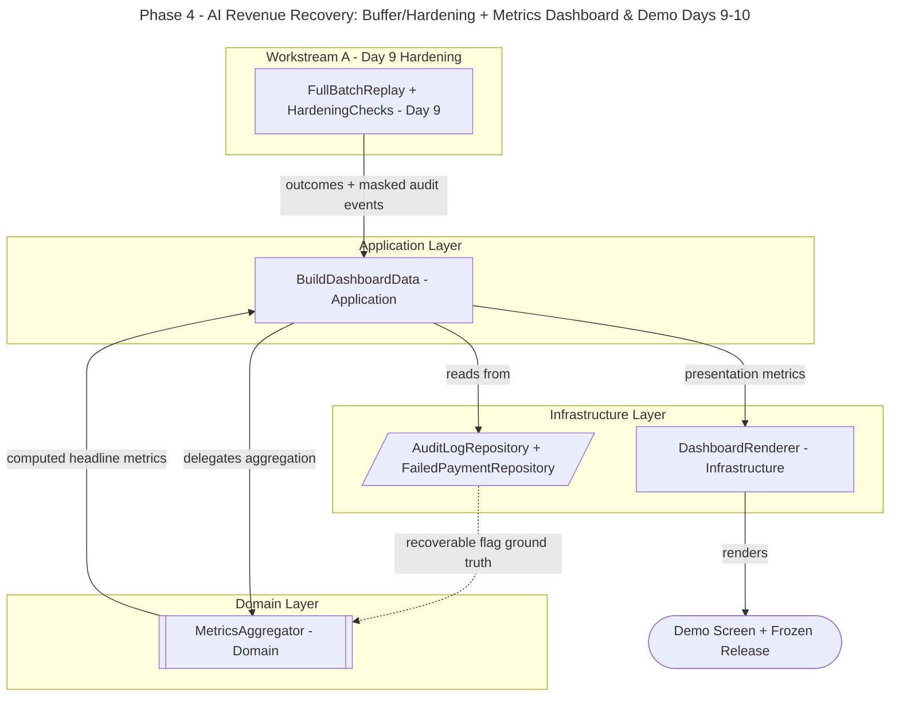

# AI Revenue Recovery — Failed-Payment Recovery Agent

## Phase 4 Implementation Plan (Days 9-10): Land It

## 1. Overview

Phase 4 is the **landing**: harden what you built, freeze it, and package the story. No new capabilities — this phase converts a working, audited recovery loop into a **credible, reproducible demo** with a single metrics screen that judges can read in ten seconds.

**Two workstreams:**

- **Day 9 — Buffer / Hardening:** re-run the full 50+ record loop clean, pass the regression suite, harden error handling, freeze features.

- **Day 10 — Metrics Dashboard & Demo:** one screen reading the masked audit events + outcomes — money recovered vs at-risk, recovery rate, intervention mix, tier breakdown, exception list, and the one graceful-failure walkthrough.

**Phase 4 milestone:** a frozen, reproducible build + a single demo screen that tells the whole story: *"%X recovered of ₹Y at-risk, honestly measured, every action audited, one failure handled gracefully."*

Design constraint carried forward: **internal DDD-style modular monolith**, **open-source only**. The dashboard is a self-contained open-source renderer (Streamlit or static HTML) — no proprietary or LLM Suite features.

## 2. Phase 4 Scope & Non-Goals

**In scope:**

- `FullBatchReplay` — clean end-to-end re-run of Phases 1-3 with the fixed seed (reproducibility proof).
- `HardeningChecks` — regression suite green, error-handling hardening, feature freeze.
- `MetricsAggregator` domain service — pure computation of headline metrics.
- `BuildDashboardData` use-case — reads audit log + outcomes, delegates aggregation.
- `DashboardRenderer` adapter — one demo screen.
- Frozen release (feature-frozen, reproducible).

**Non-goals (deferred / out of scope):**

- New recovery logic, new interventions + frozen
- Real Razorpay test-mode wiring → optional, behind the existing port only
- ML / multi-channel / voice → out of scope
- Anything that isn't money-recovered, audit trail, or the graceful-failure demo

## 3. Architecture Plan

### 3.1 DDD layering + the two workstreams

- **Workstream A — Day 9 (Hardening):**
  - `FullBatchReplay` — re-runs the entire loop (Phases 1-3) clean, confirming the fixed seed reproduces identical results.
  - `HardeningChecks` — regression test pass, error-handling hardening, feature freeze.
- **Workstream B — Day 10 (Dashboard):**
  - **Application:** `BuildDashboardData` — reads masked `AuditEvents` (Phase 3) + `RecoveryAttempt` outcomes (Phase 2), aggregates into presentation metrics.
  - **Domain:** `MetricsAggregator` — pure, no I/O: money recovered vs recoverable (ground truth), recovery rate, intervention mix, tier breakdown, exception list.
  - **Infrastructure:** `AuditLogRepository` (read), `FailedPaymentRepository` (read + ground-truth `recoverable_flag`), `DashboardRenderer` (Streamlit / static HTML, self-contained).

### 3.2 Flow

`FullBatchReplay` re-runs the loop → outcomes + masked audit events persisted. `BuildDashboardData` reads `AuditLogRepository` + `FailedPaymentRepository` + `MetricsAggregator` computes the headline metrics → `DashboardRenderer` produces the single demo screen. The ground-truth `recoverable_flag` feeds the recovery-rate denominator.

### 3.3 Visual Architecture Diagram



## 4. Proposed Module Layout (additions to the DDD monolith)

```text
revenue_recovery/
├── domain/
│   ├── metrics.py                # MetricsAggregator (pure headline-metric computation)
│   └── ...                       # (entities/policies from Phase 1-3)
├── application/
│   ├── full_batch_replay.py      # FullBatchReplay (Day 9)
│   ├── build_dashboard_data.py   # BuildDashboardData use-case (Day 10)
│   └── ...
├── infrastructure/
│   ├── dashboard_renderer.py     # Streamlit / static-HTML adapter
│   └── ...                       # (audit_repository, repository from Phase 2-3)
└── tests/
    ├── test_metrics_aggregator.py
    └── test_full_batch_replay_reproducible.py
```

## 5. Open-Source Tech Stack (Phase 4 additions)

All permissively licensed — nothing proprietary, nothing LLM Suite.

| Concern | Open-Source Choice | License | Role |
|---|---|---|---|
| Dashboard / demo screen | `streamlit` (or plain static HTML + Jinja2) | Apache-2.0 / BSD | Single self-contained metrics screen |
| Charts (optional) | `plotly` or `matplotlib` | MIT / PSF-BSD | Intervention mix / tier breakdown visuals |
| Metric computation | stdlib + `pandas` | PSF / BSD | Aggregation in the domain service |
| Reproducibility | fixed seed (from Phase 1) | — | `FullBatchReplay` determinism |
| Testing | `pytest` | MIT | Regression + reproducibility guardrails |

Add to `requirements.txt`:

```text
streamlit>=1.36
plotly>=5.22
```

*(pandas, pytest already present from earlier phases. Prefer static HTML + Jinja2 if you want zero runtime server for the demo.)*

## 6. Dashboard Metrics (one screen)

| Metric / Panel | Source | What it proves |
|---|---|---|
| Money recovered vs at-risk (₹) | outcomes + ground truth | Headline impact number |
| Recovery rate (%) | recovered / recoverable (Phase 1 flag) | Honest, non-cherry-picked |
| Intervention mix | audit events by action | Right intervention, not blind retry |
| Tier breakdown (T1/T2/T3) | audit events by tier | Compliant escalation |
| Exception list | unresolved + reason codes | Honesty about failures |
| Graceful-failure walkthrough | one refused hard-fraud record | “One failure handled gracefully” |

---

## 7. Task Breakdown + Code Scaffold (Days 9-10)

### Day 9 — Buffer / Hardening

- **T9.1** Implement `FullBatchReplay` — clean end-to-end re-run of the full loop (Phases 1-3) with the fixed seed.
- **T9.2** Assert reproducibility — same seed produces identical recovered total + audit-event count across two runs.
- **T9.3** Run the full regression suite (all Phase 1-3 tests green); fix the one thing that broke.
- **T9.4** Harden error handling on the batch loop (rail exceptions, empty batch, unknown codes + safe outcomes, never crash mid-batch).
- **T9.5** Feature freeze — tag the reproducible build; no new capabilities after this point.

### `application/full_batch_replay.py` — T9.1, T9.2, T9.4

```python
"""T9.1/T9.2/T9.4 — FullBatchReplay: clean, reproducible end-to-end re-run."""
from __future__ import annotations
from application.execute_recovery_batch import ExecuteRecoveryBatchP3

class FullBatchReplay:
    """Re-runs the whole loop and returns a reproducibility fingerprint."""

    def __init__(self, batch_runner: ExecuteRecoveryBatchP3, audit_repo) -> None:
        self._runner = batch_runner
        self._audit_repo = audit_repo

    def run(self) -> dict:
        try:
            self._runner.run()  # T9.4 hardened: never crash mid-batch
        except Exception as exc:  # noqa: BLE001 — batch must degrade gracefully
            return {"status": "error", "error": str(exc)}

        events = self._audit_repo.all_events()
        recovered = sum(1 for e in events if e.outcome == "recovered")

        # T9.2 fingerprint: deterministic given the fixed Phase-1 seed
        return {
            "status": "ok",
            "event_count": len(events),
            "recovered_count": recovered,
        }
```

### `tests/test_full_batch_replay_reproducible.py` — T9.2, T9.3

```python
from application.full_batch_replay import FullBatchReplay

# assumes a wire_batch() test helper that builds the runner + in-memory repos
def test_replay_is_reproducible(wire_batch):
    a = FullBatchReplay(*wire_batch()).run()
    b = FullBatchReplay(*wire_batch()).run()
    assert a["status"] == "ok"
    # Same fixed seed => identical fingerprint across independent runs.
    assert a["event_count"] == b["event_count"]
    assert a["recovered_count"] == b["recovered_count"]
```

### Day 10 — Metrics Dashboard & Demo

- **T10.1** Implement `MetricsAggregator` domain service: pure computation of money recovered vs recoverable, recovery rate, intervention mix, tier breakdown, exception list.
- **T10.2** Implement `BuildDashboardData` use-case: read audit log + outcomes, delegate to `MetricsAggregator`.
- **T10.3** Implement `DashboardRenderer`: one self-contained screen (Streamlit or static HTML).
- **T10.4** Surface the **graceful-failure walkthrough** panel (the one refused hard-fraud record + its audit line).
- **T10.5** Dry-run the demo; confirm the headline number and every panel render from the frozen build.

### `domain/metrics.py` — T10.1

```python
"""T10.1 — MetricsAggregator: pure headline-metric computation. No I/O."""
from __future__ import annotations
from collections import Counter
from dataclasses import dataclass

@dataclass(frozen=True)
class DashboardMetrics:
    money_recovered: float
    money_recoverable: float  # ground-truth denominator
    recovery_rate: float
    intervention_mix: dict[str, int]
    tier_breakdown: dict[str, int]
    exception_list: list[dict]

class MetricsAggregator:
    def compute(
        self,
        *,
        audit_events: list,
        recoverable_amounts: dict[str, float],
    ) -> DashboardMetrics:
        recovered = sum(
            recoverable_amounts.get(e.txn_id, 0.0)
            for e in audit_events
            if e.outcome == "recovered"
        )
        recoverable = sum(recoverable_amounts.values())  # Phase 1 ground truth
        rate = (recovered / recoverable) if recoverable else 0.0

        mix = Counter(e.action for e in audit_events)
        tiers = Counter(e.tier for e in audit_events)

        exceptions = [
            {"txn_id": e.txn_id, "reason_code": e.reason_code, "action": e.action}
            for e in audit_events
            if e.outcome in ("failed", "escalated")
        ]

        return DashboardMetrics(
            money_recovered=round(recovered, 2),
            money_recoverable=round(recoverable, 2),
            recovery_rate=round(rate, 4),
            intervention_mix=dict(mix),
            tier_breakdown=dict(tiers),
            exception_list=exceptions,
        )
```

### `tests/test_metrics_aggregator.py` — guardrail

```python
from domain.metrics import MetricsAggregator

class _E:  # minimal fake audit event
    def __init__(self, txn_id, outcome, action="retry", tier="T1",
                 reason_code="recovered"):
        self.txn_id, self.outcome, self.action = txn_id, outcome, action
        self.tier, self.reason_code = tier, reason_code

def test_recovery_rate_uses_ground_truth_denominator():
    agg = MetricsAggregator()
    events = [
        _E("t1", "recovered"),
        _E("t2", "failed", reason_code="rail_declined"),
    ]
    recoverable = {"t1": 1000.0, "t2": 3000.0}  # ground truth: 4000 recoverable
    m = agg.compute(audit_events=events, recoverable_amounts=recoverable)
    assert m.money_recovered == 1000.0
    assert m.money_recoverable == 4000.0
    assert m.recovery_rate == 0.25  # 1000 / 4000 — honest, not cherry-picked

def test_exceptions_capture_failed_and_escalated():
    agg = MetricsAggregator()
    events = [
        _E("t1", "recovered"),
        _E("t2", "escalated", reason_code="do_not_retry"),
        _E("t3", "failed", reason_code="rail_declined"),
    ]
    m = agg.compute(audit_events=events, recoverable_amounts={"t1": 1.0})
    assert len(m.exception_list) == 2
```

### `application/build_dashboard_data.py` — T10.2

```python
"""T10.2 — BuildDashboardData: reads repos, delegates aggregation. No business rules."""
from __future__ import annotations

from domain.metrics import DashboardMetrics, MetricsAggregator

class BuildDashboardData:
    def __init__(self, audit_repo, payment_repo,
                 aggregator: MetricsAggregator) -> None:
        self._audit_repo = audit_repo
        self._payment_repo = payment_repo
        self._aggregator = aggregator

    def run(self) -> DashboardMetrics:
        events = self._audit_repo.all_events()

        # Ground-truth recoverable amounts: amount where recoverable_flag is True.
        recoverable = {
            r.txn_id: float(r.amount)
            for r in self._payment_repo.read_batch()
            if r.recoverable_flag
        }

        return self._aggregator.compute(
            audit_events=events, recoverable_amounts=recoverable)
```

### `infrastructure/dashboard_renderer.py` — T10.3, T10.4

```python
"""T10.3/T10.4 — DashboardRenderer: one self-contained Streamlit demo screen."""
from __future__ import annotations

import streamlit as st

from application.build_dashboard_data import BuildDashboardData

def render(build: BuildDashboardData) -> None:
    m = build.run()

    st.title("AI Revenue Recovery — Demo")

    c1, c2, c3 = st.columns(3)
    c1.metric("Money recovered (₹)", f"{m.money_recovered:,.0f}")
    c2.metric("At-risk / recoverable (₹)", f"{m.money_recoverable:,.0f}")
    c3.metric("Recovery rate", f"{m.recovery_rate:.1%}")

    st.subheader("Intervention mix")
    st.bar_chart(m.intervention_mix)

    st.subheader("Escalation tier breakdown")
    st.bar_chart(m.tier_breakdown)

    st.subheader("Exception list (honest failures)")
    st.dataframe(m.exception_list)

    # T10.4 — the one graceful-failure walkthrough
    st.subheader("Graceful failure — one refused hard-fraud record")
    refused = [e for e in m.exception_list if e["reason_code"] == "do_not_retry"]
    st.write(refused[0] if refused else "No do-not-retry record in this batch run.")

# Run with: streamlit run infrastructure/dashboard_renderer.py
```

### How to run

```bash
pip install -r requirements.txt
pytest -q                                  # Day 9: regression + reproducibility green
python -m application.full_batch_replay    # Day 9: clean reproducible re-run
streamlit run infrastructure/dashboard_renderer.py  # Day 10: launch the one demo screen
```

---

## 8. Phase 4 Exit Criteria / Definition of Done

- [ ] `FullBatchReplay` re-runs the whole loop clean, end to end, over 50+ records.
- [ ] Reproducibility proven — same seed yields identical recovered total + audit-event count across runs.
- [ ] Full regression suite (Phases 1-4) green.
- [ ] Batch loop hardened — rail errors / empty batch / unknown codes degrade safely, never crash mid-batch.
- [ ] Feature freeze tagged; no new capabilities after Day 9.
- [ ] One demo screen renders: money recovered vs at-risk, recovery rate, intervention mix, tier breakdown, exception list.
- [ ] Graceful-failure walkthrough visible on the screen (one refused hard-fraud record).
- [ ] `MetricsAggregator` is pure (no I/O); recovery-rate denominator is the Phase 1 ground-truth `recoverable_flag`.

## 9. Risks & Mitigations for Phase 4

| Risk | Mitigation |
|---|---|
| Last-minute feature creep breaks a working build | Hard feature freeze on Day 9; only bug-fixes after |
| Demo can't reproduce the headline number | `FullBatchReplay` + fixed seed; dry-run the demo on Day 10 |
| Recovery rate looks inflated / cherry-picked | Denominator is the Phase 1 ground-truth `recoverable_flag`; test-enforced |
| Dashboard pulls raw PII into the screen | Reads only already-masked audit events from Phase 3; never the raw `customer_ref` |
| Aggregation logic leaking into the renderer (breaks DDD) | Keep computation in `MetricsAggregator` (Domain); renderer only displays |
| No buffer for the thing that breaks | Day 9 is reserved buffer; freeze early, harden, then present |
